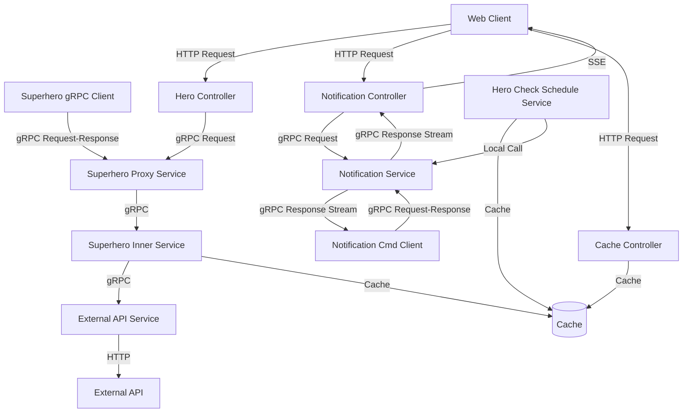
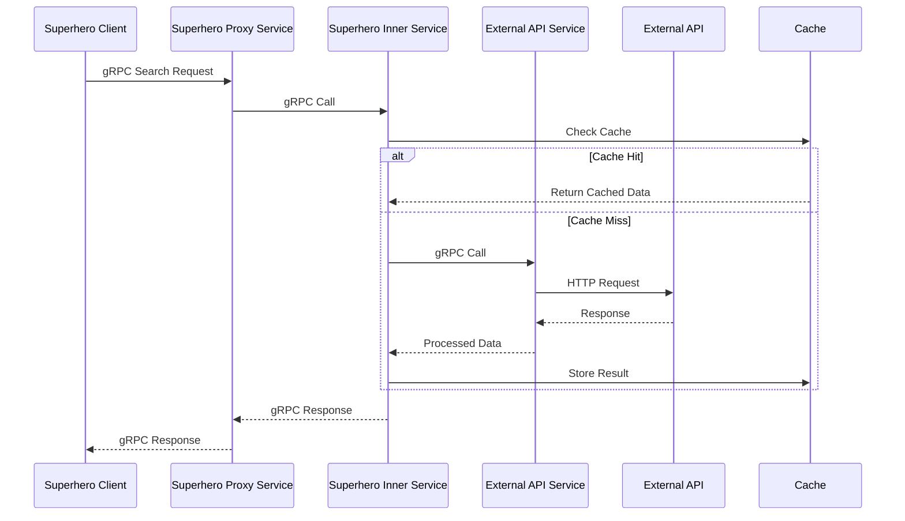
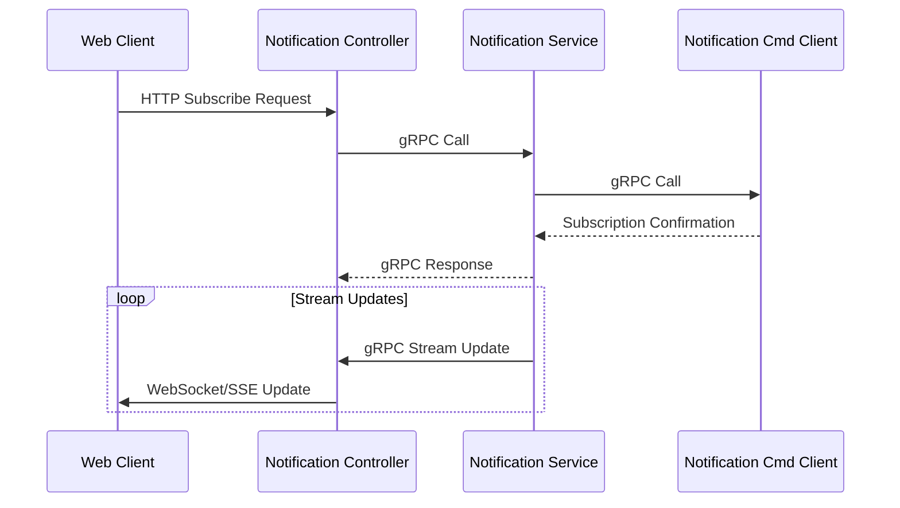
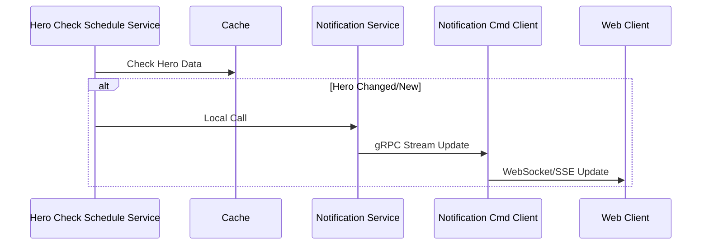

# Superhero Proxy System Architecture

## System Components

## Key Flows

### 1. Search Hero Flow

### 2. Subscribe to Hero Changes Flow

### 3. Hero Check Schedule Flow

## Component Descriptions

1. **Web Layer**
   - `HeroController`: Handles HTTP requests for hero-related operations and receives gRPC stream updates
   - `NotificationController`: Manages notification subscriptions and receives gRPC stream updates
   - `CacheController`: Provides cache management

2. **Service Layer**
   - `SuperheroProxyService`: Main service orchestrating hero operations with bidirectional gRPC streaming
   - `SuperheroInnerService`: Internal service for hero data processing with bidirectional gRPC streaming
   - `NotificationService`: Manages notification subscriptions and delivery with bidirectional gRPC streaming
   - `ExternalApiService`: Handles communication with external superhero API
   - `HeroCheckScheduleService`: Scheduled job for checking hero changes, updates cache and notifies locally

3. **Client Layer**
   - `SuperheroGrpcClient`: gRPC client for internal superhero services with bidirectional streaming
   - `NotificationCmdClient`: Client for notification command operations with bidirectional streaming

4. **External Systems**
   - External Superhero API: Source of superhero data
   - Cache: In-memory cache for performance optimization 